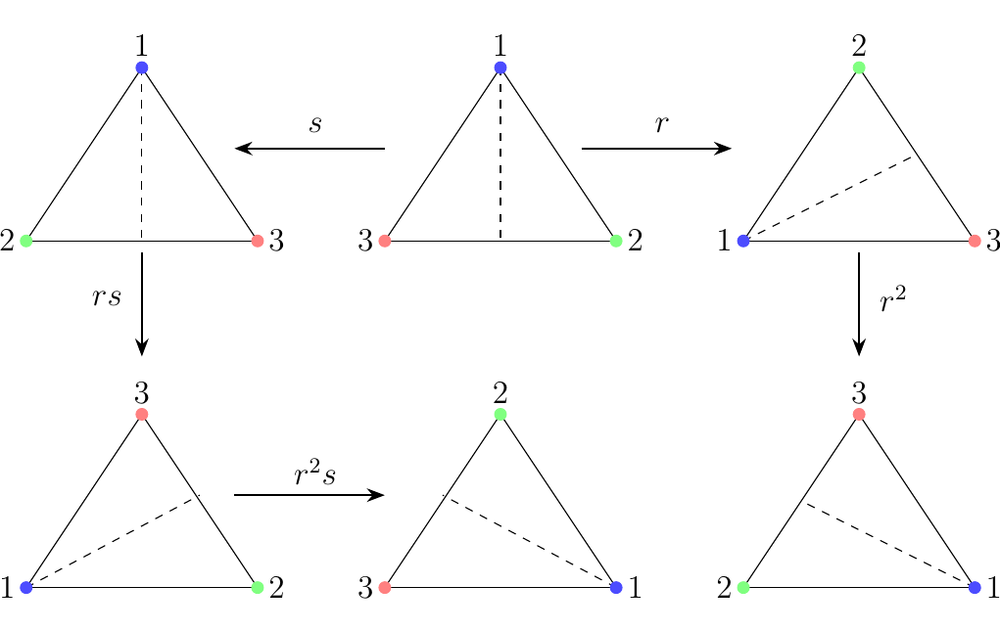

#1.1. Definitions

A **group** is a set $G$, equipped with a binary operation
$\cdot : G \times G \to G$ which satisfies the three following axioms:

\begin{enumerate}
\item[**(G1)**] The operation $\cdot$ is **associative**. Specifically, $a \cdot (b \cdot c) = (a \cdot b) \cdot c$ for all $a, b, c
\in G$

\item[**(G2)**] There exists an element $e \in G$, known as the
**identity** of $G$, such that $a \cdot e = a = e \cdot a$
for all $a \in G$ 

\item[**(G3)**] For each $a \in G$, there exists an element $a^{-1} \in G$, 
known as the **inverse** of $a$, such that $a \cdot a^{-1} =
a^{-1} \cdot a = e$. 
\end{enumerate}
In this case, we say that **$G$ is a group under $\cdot$**, and denote
this  as $(G, \cdot)$.

*  Note that in order to have a group, we require a set $G$, and
a binary operation. Hence we cannot say "the set $X$ is a group." This
makes no sense, although as we will see, sometimes this is written
when the operation is obvious or stated.

* 
It goes without really explicitly stating that 
$\cdot$ must also be **closed**; that is, it
cannot map elements anywhere outside of $G$. This is due to our 
definition that $\cdot : G \times G \to G$. That is, the
codomain, or range, is always within $G$.

Let $G$ be a group. Suppose that, for any two $g, h \in G$
we have 

\[
g \cdot h = h \cdot g  
\]

then $G$ is an **abelian** or **commutative** group.

**Notation.** 
First observe that we use $\cdot$ in our definition of a group. This
is unfortunately the same notation used in modern-day numerical
multiplication (i.e., $5 \cdot 3 = 15$). Here, this is not the case;
it's just a placeholder for *some* operator. You'll get used
to this as you go in group theory.

In group theory, we denote the multiplication of
group elements $g$ and $h$ as $g \cdot h$. However, if the operator
$\cdot$ is already understood, then we will just write $gh$. If there
is possibility for confusion (i.e., perhaps in a situation in where
there are *two* operators in play) we will be more explicit and
clear about our operator. Buts for the most part we'll just write $gh$.
\\
\\
\noindent
**Example.** Consider the set $\mathbb{Z}$, and let the operator
on the elements of $\mathbb{Z}$ simply be standard addition. This is a
group, which we'll demonstrate by showing that this set equipped with
the addition operator
satisfy the three axioms.
\begin{description}
\item[(1) Closed.] From elementary mathematics, we know that if
$m, n \in \mathbb{Z}$ then $m + n \in \mathbb{Z}$. Thus this set
is closed under addition.

\item[(2) Associativity.] Observe that for any integers $n, m $
and $p$, 

\[
n + (m + p) = (n + m) + p.
\]

This is just a basic fact of elementary arithmetic.

\item[(3) Identity.] Observe that for any $n \in \mathbb{Z}$, 

\[
n + 0 = 0 + n = n.        
\]

Thus 0 is an appropriate choice of an identity. 

\item[(4) Inverse.] Consider any $n \in \mathbb{N}$. Observe that 
(1) $-n \in \mathbb{Z}$ and (2) 

\[
n + (-n) = (-n) + n = 0.
\]

Thus every element has an inverse. Note we specified that $-n \in
\mathbb{Z}$, as we wanted to emphasize that not only $-n$ exists,
but $-n$ is *in* our set $\mathbb{Z}$.    

\end{description}
With all three properties satisfied, we have that $\mathbb{Z}$ is a
group with addition. More generally, we'd say that $\mathbb{Z}$ is a
group under addition, and denote it as $(\mathbb{Z}, +)$.
\\
\\
{\color{Plum} 
Note that $\mathbb{Z}$ is not a group under multiplication. Suppose we
try to say it is one anyways. Then the most natural step is to first note that $1$
should be our identity. After all, for any $n \in \mathbb{Z}$, $1
\cdot n = n \cdot 1 = n$. If we then consider any $m \in \mathbb{Z}$,
what is the inverse of $m$? We'd need a $p \in
\mathbb{Z}$ such that 

\[
m\cdot p = p\cdot m = 1.
\]

This has no solution if $m > 1$; for example, there is no integer $p$ 
such that $5 \cdot p = 1$. In fact, $p = \dfrac{1}{5}$, can only
satisfy this in the set of real numbers, but $\dfrac{1}{5}$ is not
in $\mathbb{Z}$. Thus $\ZZ$ is not a group under multiplication, but
it is a group under addition.
}

\textcolor{red}{We reiterate again that these two examples highlight the fact that a
group requires two things: a set, and a well-defined operator that
acts on the set.}
\\

It turns out that $\mathbb{Q}\setminus\{0\}$ (not including zero) is a group under
multiplication. Also, $\mathbb{R}$ is a group under multiplication and
a group under addition. We wont show this (it's not much work) and
will instead move onto more interesting examples which capture how
versatile the definition of a group really is. 

\noindent
**Example.**
Consider the set of $n \times n$ matrices with determinant 1 and entries in $\mathbb{R}$, where
the multiplication is standard matrix multiplication. This is
known as the **Special Linear Group** and is denoted
$SL_n(\mathbb{R})$. We'll show that this set is a group.
\begin{description}
\item[(1) Closed.] First we need to check if this operation is
closed. That is, for $A, B \in SL_n(\mathbb{R})$, is it true that
$AB \in SL_n(\mathbb{R})$?

We know products of $n \times n$ matrices give
back $n \times n$ matrices. So the real question is, 
if two matrices both have
determinant 1, will their product necessarily be a matrix
whose determinant is also 1? 
The answer is yes. From linear algebra, we know that 

\[
\det(AB) = \det(A)\det(B).
\]

Now if $A, B$ have determinant 1, 

\[
\det(AB) = \det(A)\det(B) = 1 \cdot 1 = 1.   
\]

Therefore, $AB \in SL_n(\mathbb{R})$, since $AB$ is $n \times n$
and it has determinant 1.

\item[(2) Associativity.] For matricies $A, B, C \in
SL_n(\mathbb{R})$, we know from linear algebra that 

\[
(AB)C = A(BC).
\]

That is, matrix multiplication is associative.

\item[(3) Identity.] Naturally, the identity matrix $I$ serves as
our group identity. This is because for any $A \in
SL_n(\mathbb{R})$, $AI = IA = A$.

\item[(4) Inverses.] For any $A \in SL_n(\mathbb{R})$, $\det(A) =
1$. Specifically observe that $\det(A) \ne 0$. Therefore by the 
invertible matrix theorem, $A$
has an inverse element $A^{-1}$ such that $AA^{-1} = A^{-1}A = I$.
But the real question is: is it true that $A^{-1} \in SL_n(\mathbb{R})$? 

To answer this, observe that $AA^{-1} = I$
and that $\det(I) = 1$. Thus 

\[ 
\det(AA^{-1}) = \det(I) = 1.
\]

However, since $\det(AA^{-1}) = \det(A)\det(A^{-1})$,

\[
\det(AA^{-1}) = 1 \implies \det(A)\det(A^{-1}) = 1.
\]

But $A \in SL_n(\mathbb{R})$, so $\det(A) = 1$. Therefore,
$\det(A)^{-1} = 1$, so that $A^{-1} \in SL_n(\mathbb{R})$. 
\end{description}
Thus $SL_n(\mathbb{R})$ does form a group. 

\textcolor{MidnightBlue}{
You may be wondeirng: Why did we focus on matrices with determinat
1? Why not consider all matrices in general? 
\\
\indent At first, the set of all $n \times n$ matrices with
coefficients in $\mathbb{R}$, denoted by $M_{n\times
n}(\mathbb{R})$, may seem like a group. But recall from linear
algebra that some matrices are not invertible under matrix
multiplication. Thus we can't form a group since some matrices
would just not have an inverse. 
}

However, consider the following set:

\[
G = \left\{ 
\begin{pmatrix}
a & a\\
a & a
\end{pmatrix}
: a \in \mathbb{R}-\{0\} \right\}.
\]

Clearly, these elements are not invertible matrices under matrix
multiplication. However, we can still form a group out of this!

Naturally, we'd want to make the identity element as
$\displaystyle 
\begin{pmatrix}
1 & 0\\
0 & 1
\end{pmatrix}$, since this is the natural identity when it comes
to matrix multiplication. However, this isn't in the above set,
which may make you wonder if this really is a group.

\begin{description}
\item[(1) Closed.] First we show that this is closed. Let 

\[
A = \begin{pmatrix}
a & a\\
a & a
\end{pmatrix}, 
B = 
\begin{pmatrix}
b & b\\
b & b
\end{pmatrix}
\]

where $a, b \in \mathbb{R}-\{0\}$. Now observe that 

\[
AB = 
\begin{pmatrix}
a & a\\
a & a
\end{pmatrix}
\begin{pmatrix}
b & b\\
b & b
\end{pmatrix}
= 
\begin{pmatrix}
2ab & 2ab\\
2ab & 2ab
\end{pmatrix}.
\]

Since $2ab \in \mathbb{R}-\{0\}$, we see that $AB \in G$.
Hence, the set is closed.

\item[(2) Associativity.] Again, from linear algebra, we
already know that matrix multiplication is associative.

\item[(3) Identity.] What should we make our identity? One can
realize that 

\[
e= \begin{pmatrix}
1 & 1\\
1 & 1
\end{pmatrix}
\]

suffices for an identity. That is, for any $A = 
\begin{pmatrix}
a & a\\
a & a
\end{pmatrix}$, we see that 

\[
Ae = 
\begin{pmatrix}
a & a\\
a & a
\end{pmatrix}
\begin{pmatrix}
1 & 1\\
1 & 1
\end{pmatrix}
= A
\]

and 

\[
eA = 
\begin{pmatrix}
1 & 1\\
1 & 1
\end{pmatrix}
\begin{pmatrix}
1 & 1\\
1 & 1
\end{pmatrix}
= A.
\]

Hence $Ae = A = eA$, so that it works correctly as an identity.

\item[(4) Inverses.] For any $A = 
\begin{pmatrix}
a & a\\
a & a
\end{pmatrix}$, we can write $A^{-1} = 
\begin{pmatrix}
\frac{1}{2a} & \frac{1}{2a}\\
\frac{1}{2a} & \frac{1}{2a}
\end{pmatrix}$. Note that since $a \in \mathbb{R} -\{0\}$
implies that $\frac{1}{2a} \in \mathbb{R} - \{0\}$, so that
$A^{-1} \in G$. Now we see that 

\[
AA^{-1} 
= 
\begin{pmatrix}
a & a\\
a & a
\end{pmatrix}
\begin{pmatrix}
\frac{1}{2a} & \frac{1}{2a}\\
\frac{1}{2a} & \frac{1}{2a}
\end{pmatrix}
= 
\begin{pmatrix}
1& 1\\
1 & 1
\end{pmatrix}
\]

and 

\[
A^{-1}A =
\begin{pmatrix}
\frac{1}{2a} & \frac{1}{2a}\\
\frac{1}{2a} & \frac{1}{2a}
\end{pmatrix}  
\begin{pmatrix}
a & a\\
a & a
\end{pmatrix}
= 
\begin{pmatrix}
1& 1\\
1 & 1
\end{pmatrix}.
\]

Thus we see that for every $A \in G$, there exists an element
$A^{-1} \in G$ such that $AA^{-1} = e = A^{-1}A$.
\end{description}
With all four axioms satisfied, we see that $G$ forms a group.

**Example.** Consider an equilateral triangle. The set of rigid transformations
which preserve symmetry form a group. This is actually just a
special case of the more general **Dihedral Group** $D_{2n}$.

There are many ways we can
think of transforming a triangle. But we can always break them
down into
rotations, denoted by $r$, of 120$^\circ$, and reflections across a
a diagonal of symmetry, denoted by $s$. 
It turns out that the full list of unique rotations we can come up
with are 

\[
\{e, r, r^2, s, rs, r^2s\}  
\]

which we can illustrate visually with the triangles below.
\begin{figure}[h]
\centering

\end{figure}

Let $(G, \cdot)$ be a group. Then the following hold:

* [1.] The identity $e \in G$ is unique

* [2.] The inverse $g^{-1} \in G$ is unique for every $g
\in G$.

* [3.] For any $g \in G$, $(g^{-1})^{-1} = g$. 

* [4.] Let $g, h \in G$. Then $(g \cdot h)^{-1} = h^{-1} \cdot g^{-1}$.   

* [5.] Let $g_1, g_2, \dots, g_n \in G$. The product $g_1
\cdot g_2 \cdot \vspace{0.01mm} \dots \vspace{0.01mm} \cdot
g_n$ is independent of its bracketing. 

* [6.] Let $g, h \in G$. There always exist $x, y$ such
that $g \cdot x = h$ and $h \cdot y = g$.

\begin{description}
\item[1.] Suppose there exists another identity 
element $f$, different from $e$, such that
$g \cdot f = f \cdot g = g$ for all $g \in G$. Then 

\[
e = e \cdot f = f
\]

so that $e = f$. Therefore, the identity element is unique.

\item[2.] Suppose $h_1$ and $h_2$ are both inverses of $g \in
G$. Then by definition, $h_2 \cdot g = e = g \cdot h_2$ and $h_1 \cdot g = e
= g \cdot h_1$. Therefore, 

\[
h_1 = (h_2 \cdot g) \cdot h_1 = \underbrace{h_2 \cdot (g \cdot h_2)}_{\text{by associativity of G}}
= h_2 \cdot e = h_2.
\]

Thus $h_1 = h_2$, so that the inverse of $g$ os unique. 

\item[3.] Observe that for any $g \in G$,

\[
g^{-1}\cdot (g^{-1})^{-1} = e
\]

by defintion. Multiplying on the left by $g$ on both sides of
the equation, we get 

\begin{align*}
g \cdot (g^{-1} \cdot (g^{-1})^{-1}) = g \cdot e
\implies (g \cdot g^{-1}) \cdot (g^{-1})^{-1} = g 
\end{align*}

by associativity. Since $g \cdot g^{-1} = e$, this then leads to 

\begin{align*}
e \cdot (g^{-1})^{-1} = g \implies (g^{-1})^{-1} = g
\end{align*}

as desired.

\item[4.] Note that $(g \cdot h)^{-1} \cdot (g \cdot h) = e.$
Therefore,

\[
(g \cdot h)^{-1} \cdot (g \cdot h) = e \implies (g \cdot h)^{-1} \cdot g = h^{-1}
\implies (g \cdot h)^{-1} = h^{-1} \cdot g^{-1}
\]

by first multiplying on the right by $g^{-1}$ and then by
$h^{-1}$, which proves the formula.

\item[5.] We can demonstrate this by induction. First write
our proposition as

\[
P(n)
=
\begin{cases}
\text{For any } g_1, g_2, \dots, g_n \in G\text{ we have that }\\
g_1\cdot g_2 \cdots g_n \text{ is independent of its bracketing. }
\end{cases}
\]

\begin{description}
\item[Base Case.]
For the base case $n = 1$, there is nothing to check.
\item[Inductive Step.]
Now suppose that $P(n)$ is true for all positive integers
$n \le n_0$. Then let $g_1, g_2, \dots g_{n+1}
\in G$ and consider 

\[
g_1\cdot g_2 \cdots \cdot g_{n+1}.
\]

Observe that we clearly have that 

\[
g_1\cdot g_2 \cdots \cdot g_{n+1}. = (g_1\cdot g_2 \cdots \cdot g_{i})\cdot(g_{i+1} \cdots \cdot g_{n+1}).
\]

for all $1 \le i le n + 1$. Hence we can apply the
inductive hyptohesis to each of the subproducts $(g_1\cdot
g_2 \cdots \cdot g_{i})$ and $(g_{i+1} \cdots \cdot
g_{n+1})$ generated
in each case. Since this exhausts all possible
subproducts, and the values do not change by our inductive
hypothesis, we see that $P(n + 1)$ is true. Hence $P(n)$
holds for all $n \in \mathbb{N}$. 
\end{description}

\item[6.] Observe that if we have the equation $g \cdot x =
h$, then we can multiply both sides on the right by $g^{-1}$
to observe that 

\[
(g^{-1} \cdot g) \cdot x = g^{-1} \cdot h \implies x = g^{-1} \cdot h.
\]

Since $x$ is the product of elements of $G$ (namely, $g^{-1}
\cdot h$) and because $G$ is closed under $\cdot$, we have
that $x \in G$. Thus a solution exists in $G$. The proof for
the existence of $y \in G$ such that $h \cdot y = g$ is
exactly the same.
\end{description}

In our study of group theory, many of the groups we'll deal with will
actually turn out to be finite. We'll also be interested in breaking
down the structures of finite groups (a lot of things can happen). 
A couple things should be noted about finite groups.

{\color{MidnightBlue}
Consider $g \in G$, where $G$ is a **finite group**. Since $G$ must be
closed under its product, we note that $g^2 \in G$, $g^3 \in G$, and so
on. That is, all powers of $g$ must be in $G$. But since $G$ is
*finite*, there must exist some $m \in
\mathbb{N}$ such that $g^m = e$. If not, you could keep raising the
power of $g$, and keep getting new elements. Since you'd never come
back to $e$, you could then generate an infinite set
$\{g, g^2, g^3, g^4, \dots\}$ entirely contained in $G$. But this
would imply $G$ is infinite, which it isn't.}

\noindent

Let $G$ be a group. The **order of an element** $g \in G$ is
the smallest integer $n$ such that $g^n = e$. 

In addition, if $G$ is a finite group, then we can also talk about
the **order of a group** $|G|$, which we define as the number of
elements within the group.

The order is denoted
as $|g|$; thus we'd say that $|g| = n$ if $g$ has order $n$. If
$G$ is infinite, it may be possible that $|g| = \infty$. On the
topic of order, we define that $g^0 = e$.

\subsection*{Subgroups.}

Let $G$ be a group, and consider a subset $H$ of $G$. We define
$H$ to be **subgroup** of $G$ if $H$ is also a group.

{\color{blue}The definition is exactly what it sounds like: $H$ is a subgroup
if $H \subset G$ and $H$ is a group. You might note that the
definition is clear, but determining if a set is a subgroup of $G$
sounds like a lot of work. Fortunately there's the subgroup test.
}

Let $H$ be nonempty and suppose $H \subset G$. Then $H$ is a
subgroup if and only if for all $x, y \in H$, $xy^{-1} \in H$.

\noindent **If $\mathbf{H**$ is a subgroup, we usually write $\mathbf{H \le G}$ if we
are trying to be concise.}

($\implies$) Suppose $H \le G$. Then since $H$ is a group,
for any $x, y \in H$, $xy^{-1} \in H$ since it is closed under
multiplication of its elements. This proves the forward
direction.
\\

($\impliedby$) Suppose $H$ is nonempty and $H \subset G$ such
that for all $x, y \in H$, $xy^{-1} \in H$. We just need to
prove $H$ is a group. We already know group multiplication is
an associative, binary operation on $G$, so it is still
associative on elements of $H$. Thus we only need to prove
closedness, existence of identity and inverses.

By the definition of $H$, for all $x, y \in H$, $xy^{-1} \in
H$. 
\begin{description}
\item[Identity.] Let $x \in H$. Then clearly $xx^{-1} = e \in H$. Thus $H$
has the identity.
\item[Inverses.] Since $x, e \in H$, we see that $ex^{-1} =
x^{-1} \in H$. Thus for all $x \in H$, $x^{-1} \in H$.
\item[Closedness.] Now let $y \in H$; hence, $y^{-1} \in H$, as just proven. Then
$x(y^{-1})^{-1} = xy\in H$, so that $H$ is closed under
multiplication of its elements.
\end{description} 
Therefore $H$ is (1) a group
and (2) a subset of $G$ so that $H \le G$, as desired.

It turns out the intersection of two subgroups is still a
subgroup. In fact, the arbitrary intersection of subgroups always
produces a subgroup. 

Let $G$ be a group and $\{H_\alpha\}_{\alpha \in \lambda}$ be
a family of subgroups of $G$. Then the set $H =
\bigcap_{\alpha \in \lambda} H_\alpha$ is a subgroup of $G$.

First, observe that 

\[
H = \bigcap_{\alpha \in \lambda} H_\alpha
\]

is nonempty. This is because each $H_\alpha \le G$ and thus
the identity of $G$ is contained in each $H_\alpha$ for all
$\alpha \in \lambda$. So the identity is in $H$ as well.

Thus let $x, y \in H$. Then $x, y \in H_\alpha$ for all $\alpha
\in \lambda$. Since each $H_\alpha$ is a group, $y^{-1}$ exists
and is contained in each $H_\alpha$. Hence, $xy^{-1} \in
H_\alpha$ for all $\alpha \in \lambda$, so we have that
$xy^{-1} \in H$. Therefore, we see by the subgroup text that $H
\le G$. 

With the basic properties of a group introduced, we now introduce
two more group definitions. 

Let $G$ be a group and $S \subset G$. The **centralizer**
of $S$ in $G$ is defined to be the set $C_G(S)$

\[
\textcolor{NavyBlue}{C_G(S)} = \{g \in G \mid gs = sg \text{ for all } s \in S\}.
\]

In the case where $G$ is abelian, we $C_G(S) = G$ for any nonempty
subset $S$ of $G$. This definition is close to the \textbf{center
of a group}, which is as follows.

Let $G$ be a group. Then the **center of a group** $G$ is
defined as 

\[
Z(G) = \{z \in G \mid zg = gz \text{ for all } g \in G\}.
\]

In this case, we note that $C_G(G) = Z(G)$ and if $G$ is abelian
$Z(G) = G$. Finally, we introduce the definition of the
normalizer.

Let $G$ be a group and $S \subset G$. The **normalizer**
of $S$ in $G$ is defined as 

\[
\textcolor{purple}{N_G(S)} = \{g \in G \mid gS = Sg\}
\]

The centralizer and the normalizer are closely related
definitions. However, these two concepts highlight the important
distinction one must understand between term-by-term equality and
set equality. \textcolor{NavyBlue}{Firstly, we can think of $C_G(S)$ as all $g \in G$
which commutes with each and every single element of $S$.} 
\textcolor{purple}{On the
other hand, if $g \in N_G(S)$, it is not necessarily true that $gs
= sg$ for all $s \in S$. The only requirement is that $gS$
creates the same set as $Sg$. Of course, one way to do this is
if $gs = sg$ for all $s \in G$. In that case, $gS = Sg$. But there
are other ways to do this, so this definition is more versatile
than $C_G(S)$.}

One interesting fact is that $C_G(S)$ and $N_G(S)$ are subgroups
of $G$ for any $S \subset G$. 

Let $G$ be a group and $S \subset G$. Then $C_G(S)$ and
$N_G(S)$ are both subgroups of $G$.

\textcolor{blue}{Note: if we let $S = G$, we see that $C_G(S) =
Z(G)$. 
Therefore, an immediate corollay of this theorem is that $Z(G)$ is
also a subgroup of $G$!}

Let $G$ be a group and $S \subset G$. To show that $C_G(S) \le
G$, we can use the subgroup test. 
\begin{description}
\item[Nonempty.] First we have to show the set is
nonempty. But note that for any $S$, $e \in C_G(S)$ 
since $gs = sg$ for any $s \in S$.

\item[Inverses.] We now show that if $x, y \in C_G(S)$
then so is $xy^{-1}$. We know that for all $s \in S$, $xs
= sx$ and $ys = sy$. Therefore $s = y^{-1}sy$ and $s =
ysy^{-1}$ by solving for $s$ in the last equation.
Plugging this into the first equation with $x$, we get 

\[
xs = sx \implies x(y^{-1}sy) = (ysy^{-1})x 
\implies xy^{-1}sy = ysy^{-1}x.
\]

Multiplying both sides on the right by $y^{-1}$ leads to 

\[
xy^{-1}s = ysy^{-1}xy^{-1} 
\implies xy^{-1}s = syy^{-1}xy^{-1}
\implies xy^{-1}s = sxy^{-1}
\]

where in the second step we used the fact that $ys = sy$.
Thus $xy^{-1} \in C_G(S)$, so by subgroup test we have
that $C_G(S) \le G$. 
\end{description}

The proof for $N_G(S)$ is the exact same; simply replace $s$
with $S$.

