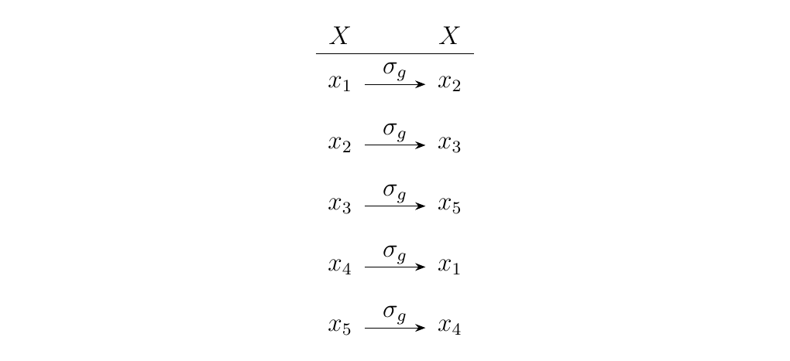

#1.9. Group Actions.
As we shall see, a group action is a special type of mapping one can
formulate involving a group $G$ and an arbitrary set of objects $X$.
Specifically, it is a mapping from $G \times X \to X$.
Thus, a group action is said to make a group $G$ "act" on a set
$X$. It is through this perspective that one can then view group
actions as permutations of a set $X$. This becomes more clear with
the formal definition. 

Let $G$ be a group and $X$ an arbitrary set. A **group
action** of $G$ on $X$ is a mapping $* : G \times X \to X$
that 

* [1.] $g_1 * (g_2 * x) = (g_1 \cdot g_2) * x$ for
all $g_1, g_2 \in G, x \in X$.

* [2.] $e * x = x$ where $e \in G$ is the identity.

Note that $\cdot$ is the *group multiplication in $G$.* For
notational convenience, we will surpress $\cdot$ in the cases for
where it's obvious or implied, as usual.
\\
We also note that we could have defined $*:X \times G \to X$. For
simplicity, we let $G$ act on the left.
\\  

Let's breakdown what this is really saying.
\textcolor{red}{For a group
action $*$ of $G$ acting on $X$, we have for all $g \in G$, $x \in
X$, the product $g * x$ is mapped to some element $x' \in X$.}

Now observe that if
we replaced $X$ with $G$, then we get $* : G \times G \to G$.
Thus $*$ would just permutate the elements of $G$.
Furthermore, if we let $*$ be the group multiplication $\cdot$ which
is already defined in $G$, then we just get back the definition of
a group! 

\textcolor{NavyBlue}{This fits with the intuition that,
group multiplication of elements (e.g., $g \cdot g'$ where $g, g'
\in G$) simply permutates the elements of a group. That is, if 
you placed the elements of $G$ in a tuple such as 

\[
(g_1, g_2, \dots, g_n)
\]

and multiplied this by some $g' \in G$, you would get a tuple 

\[
(g_1, g_2, \dots, g_n) \cdot g' 
= (g_1\cdot g', g_2 \cdot g' , \dots, g_n\cdot g')
=
(g_i, g_j, \dots, g_k)
\]

containing all the elements of $G$, but just in a different order.
(In this case we supposed $g_1 \cdot g' = g_i, g_2, \cdot g' =
g_j$, and so on.)
} 

\begin{minipage}{0.7\textwidth}
\vspace{.3cm}
This permutation phenonmenon can be found in more general
group actions.  For a fixed $g \in G$, define $\sigma_g:
X \to X$ as 

\[
\sigma_g(x) = g * x.
\]

So $\sigma_g$ maps each $x$ to some other element $x' \in X$.
Therefore, a group action can be thought of as a set of maps
$\sigma_g$, one for every element $g \in G$, each of which can
appropriately be composed with one another. 

That's why
it can be thought of as a permutation. The diagram on the right
gives an illustration how this plays out for one particular
$g \in G$ acting on a set $X$ with five elements.
\end{minipage}\hfill
\begin{minipage}{0.2\textwidth}

\end{minipage} 
\vspace{.5cm}

\textcolor{NavyBlue}{Here's another way to think about a group
action. If $G$ acts on $X$, then the group action $*$ turns each 
and every element of $g \in G$ into a *function*, which
maps $X$ to $X$. This agrees with our intuition, since a
permutation is exactly a function of $X$ to itself. }

A finite group of order $n$ is isomorphic to a subgroup of $S_n$.

This theorem is a powerful theorem that gives us a new way to
think about finite groups. It states that every finite group is
basically the same as a subgroup of a symmetric group up to an
isomorphism. 

\textcolor{NavyBlue}{To prove this, we'll first construct a
group action of $G$ on itself. Then we'll }

Consider the group action of $G$ acting on itself, whereby we
define $g_1 \cdot g_2 = g_1g_2$ for $g_1, g_2 \in G$. That is,
the group action 
mapping is simply the multiplication used between the elements
of $G$. 
\begin{description}
\item[This is a Group Action.] 
(Note: we already pointed out that if we replace $X$ with
$G$ in the definition of a group action, and let $\cdot$
be the group multiplication in $G$, then we just get the
definition of a group. Thus a group is a special, but
boring, type group action.)

To show this is a group action, let $x \in G$. Then 

\[
g_1 \cdot (g_2 \cdot x) = g_1 \cdot (g_2x) = g_1g_2x = (g_1g_2)x = (g_1g_2) \cdot x.
\]

for $g_1, g_2 \in G$.
Therefore, $g_1 \cdot (g_2 \cdot x) = (g_1g_2) \cdot x.$
The second axiom is satisfied, since if $e$ is the
identity of $G$, then clearly $e \cdot x = ex = x$. We
have both axioms satisfied. So this is a group action. 
\end{description}

Before we lead up to a powerful theorem involving group actions,
we must define a few definitions. 

Suppoe $G$ acts on a set $X$, and let $x \in X$. Then we
define the set 

\[
Gx = \{g * x \mid g \in G \}
\]

as the **orbirt** of $x$. 

The orbit basically considers the set of all images one obtains
when one grabs a single element of $x \in X$, and multiplies it by
every element $g \in G$. {\color{purple}{Note that since $g
\cdot x \in X$ for every $g \in G, x \in X$, we have that $Gx \subset X$.}}

\textcolor{NavyBlue}{Orbits are rather interesting since **they partition their acting
set $X$**. That is, if $X = \{x_1, x_2, \dots, x_n\}$, then 
$Gx_1 \cup Gx_2 \cup \cdots \cup Gx_n = X$. Note that $x_i \in
Gx_i$ for $i = 1, 2, \dots, n$, so this definitely makes sense.
\\
\\
However, it is possible that $Gx_i = Gx_j$ for some $i, j.$ In
such a case we note that for each $g \in G$ there exists a $g' \in
G$ such that $gx_i = g'x_j \implies g^{-1}g'x_j = x_i$. Since
$g^{-1}g' \in G$, 
our condition boils down to the following: 
$Gx_i = Gx_j$ for some $i, j$ if there exists a $g \in G$
such that 
$gx_j = x_i$. So $Gx_i = Gx_j$ if $x_j \in Gx_i$.}
\\
\\
Thus, these things are behaving like cosets (recall that $Gh =
Gh'$ if and only if $h' \in Gh$.) and they partition the acting
set $X$! This understanding will become helpful in the future. 
\\
\\
Since orbits form partitions, and it is possible that the set of
all orbits will be redundant (i.e., it's possible that $Gx_i =
Gx_j$ for some $i, j$), we offer the following definition.

Let $G$ be a group, and suppose it acts on a set $X$. 
Let $Gx_1, Gx_2, \cdots, Gx_n$ be a distinct set of
orbits  such that 

\[
Gx_1 \cup Gx_2 \cup \cdots G_n = X.
\]

Then each $x_1, x_2, \dots, x_n$ are called
**representatives of an orbit** of $G$. We generally
denote $R = \{x_1, x_2, \dots x_n\}$ to be the set of
representatives of the orbits. 

Thus for some orbit $Gx_i$, we say that $x_i$ "represents" this
orbit. We make this definition since we just showed that 
it doesn't really matter what representative we pick, since if 
$x_j \in Gx_j$, $Gx_j = Gx_i$, so $x_j$ could have equally
represented this orbit. Thus given this arbitrary-ness, the
definition allows us to talk about orbits more easily.

We now offer another definition regarding group actions.

Suppose $G$ acts on $X$, and $x \in X$. Then the set 

\[
G_x = \{g \in G \mid g * x = x\}.
\]

is defined to be the **stabilizer** of $x$.

The stabilizer considers the elements of $g \in G$ which act as an
identity to $x$. \textcolor{purple}{Since $G_x$ considers elements
of $G$, we see that $G_x \subset G$. Furthermore, we have the
following proposition.}

Suppose $G$ acts on $X$, and let $x \in X$. Then $G_x \le G$.

Observe first that this is nonempty, since $e * x = x$ for
all $x \in X$, where $e \in G$ is the identity. Therefore $e
\in G_x$. Next, observe that associativity is inherited from
the set $G$ itself. To check for inverses, we note that for any $g \in G$, $g \cdot x = x$, 
so we can multiply both sides by $g^{-1}$ to get

\[  
g^{-1} * g * x = g^{-1} * x \implies (g^{-1}g) * x = g^{-1} * x 
\implies x = g^{-1} * x.
\]

Thus $g^{-1} * x = x$ so $g^{-1} \in G$. Finally, observe
that the set is closed. Given $g, g' \in G_x$, we see that 

\[
(gg') * x = g * (g' * x) = g *`' (x) = x.
\]

Therefore $G_x$ is (1) a subset of $G$ and (2) a group so it
is a subgroup of $G$.

We now move onto one of the useful theorems that arises once one
realizes the definitions of the orbit and stabilizers.

Let $G$ be a finite group, and suppose $G$ acts on a set $X$.
Then for any $x \in X$ we have that 

\[
|G| = |Gx| \cdot |G_x|.
\]

To show this, we'll construct a bijection between $Gx$ and
$G/G_x$. 

Let $g \in G$ so that $gG_x \in G/G_x$. Then construct the map
$\psi: G/G_x \to Gx$ by

\[
\psi(gG_x) = g * x.
\]

Note that there is only one element in $G/G_x$ which gets
to $x$; namely, $G_x$. The calculation is as follows:

\[
\psi(G_x) = e * x = x.
\]

This map is obviously surjective, since for any $x' \in Gx$, we
we know that there exists a $g \in G$ such that $g * x = x'$.
Thus $g \not\in G_x$, so that $gG_x$ is nontrivial and
$\psi(gG_x) = g * x = x'$.

Now to show that this is injective, suppose that $g*x = h*x$.
we have that $g^{-1}h * x = x$. Therefore, $gh^{-1} \in G_x$.
Furthermoresee that 

\[
g^{-1}hG_x = G_x \implies hG_x = gG_x.
\]

Thus this can only happen if the input is the same. Therefore
this is a one-to-one and onto mapping. 

Since this is a bijection, we can conclude that 

\[
|Gx| = |G/G_x| = |G|/|G_x| \implies |G| = |Gx||G_x|    
\]

as desired.

