
#3.5. Exact Sequences and the Hom Functor.

This section will be the first encounter with the extremely
important algebraic concept of an *exact sequence*, which
is something you may have already seen before without even knowing
it. 

Let $R$ be a ring. We define a **sequence** of
$R$-modules to be a chain of homomorphisms between
$R$-modules, generally denoted as

we say that that the above sequence is **exact** at $M_i$
if $\im(f_i) = \ker(f_{i+1})$. Hence, an exact sequence is a
sequence which is exact at every $M_i$. 

\noindent **Short Exact Sequences.**\\
Looking at "short" exact sequences aids out analysis of longer or
infinite exact sequences. 

Let $M_1, M_2$ and $M$ be $R$-modules. Then

* [1.] The sequence

is exact if and only if $f$ is injective.

* [2.] The sequence

is exact if and only if $g$ is surjective. 

* [3.] 
The sequence

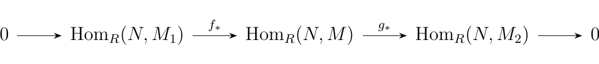
is exact if and only if $f$ is injective
and $g$ is injective.

* [1.]  
($\implies$) Suppose the sequence 

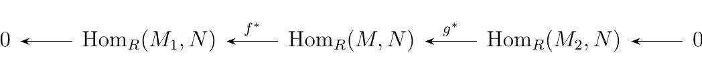

is exact. Then we have that $\im(0) = \ker(f) \implies
\ker(f) = \{0\}$. Therefore we see that $f$ is injective. 

($\impliedby$)Now suppose $f$ is injective. Then $\ker(f) = 0$. Since
$\im(0) = \{0\}$ we see $\im(0) = \ker(f)$, so that the
sequence             

is exact.

* [2.] ($\implies$) Suppose the sequence 

is exact. Then we see that $\im(g) = \ker(0) = M_2$, since
the zero map simply takes all of $M_2$ and sends it to $0$.
Hence we see that $g$ is surjective. 

($\impliedby$) Now suppose $g$ is surjective. Then $\im(g)
= M_2$ and we also have that $\ker(0) = M_2$. Therefore
$\im(g) = \ker(0)$ so that we have an exact sequence. 

* [3.] By applying (1.) and (2.), the result follows.

The above proposition offers the following definitions. 

Let $M_1, M_2$ and $M$ be $R$-modules. If the sequence

is exact then we say it forms an **short exact
sequence**. Furthermore, if there exists an $R$-module $N$ such
that $M = N \oplus \im(f) = N \oplus \ker(g)$ (since $\im(f) =
\ker(g)$) then we say the above sequence is **split
exact**.

In this case, we say $N$ or $\im(f)$ is a **direct   
summand** of $M$.

We can offer a few short exact sequences with some familiar
objects. 
\\
\\
**Examples.**

* [1.] Let $M$ be an $R$-module with a submodule $N$. If
$i:N \to M$ is the inclusion map and 
$\pi: M \to M/N$ is the projection map, then the sequence 

is exact. \\
$\bm{\im(i) \subset \ker(\pi)}$. Observe
that if $n \in N$ then 

\[ 
\pi(i(n)) = \pi(n) = n + N = N
\]

so that $\im(i) \subset \ker(g)$.
\\
$\bm{\ker(\pi) \subset \im(i)}$. Suppose $m
\in \ker(\pi)$. Then we see that $\pi(m) = m + N = N$, so that
$m \in N$. Since $m \in N$, we know that $i(m) = m$. Therefore
$m$ is the image of some element in $M$ mapped by $i$ (namely,
just $m$ itself). Hence $\ker(\pi) \subset \im(i)$.

With both directions, we can conclude that $\im(i) = \ker(\pi)$ so
so that the sequence is exact.

* [2.] Let $N$ and $P$ be $R$-modules. If we define $i':N
\to N \oplus P$ where $i'(n) = (n, 0)$ and $\pi': N \oplus P
\to P$ where $\pi'(n, p) = p$, we see that the sequence

is exact. We can realize this by simply observing that
$\ker(\pi')$ is the set of all elements $(n, 0) \in N \oplus
P$, which is exactly the image of $i'$. Therefore $\im(i') =
\ker(\pi')$, so that the sequence is exact.

* [3.] The sequence

where $f:\ZZ_p \to \ZZ_{pq}$ is given by $f(n) = qn$ and
$g: \ZZ_{pq} \to \ZZ_q$ is given by $g(n) = n \mbox{ mod } q$,
then this sequence is exact. In fact, it is a split exact sequence.
From group theory, we know that 

\[
\ZZ_{mn} \cong \ZZ_m \oplus \ZZ_n
\]

if and only if $m$ and $n$ are coprime. In our case, $p$ and
$q$ are distint primes and hence are coprime so that $\ZZ_{pq} \cong \ZZ_p \oplus \ZZ_q$. We'll later show
that this will be sufficient to conclude that this is a split
sequence.

* [4.] If instead we have the sequence

where $f:\ZZ_p \to \ZZ_{p^2}$ is given by $f(n) = pn$ and
$g: \ZZ_{p^2} \to \ZZ_p$ is given by $g(n) = n \mbox{ mod }p$,
then this becomes
an exact sequence. However, this is not split exact as
$p$ is obviously not comprime with itself, and hence 

\[
\ZZ_{p^2} \not\cong \ZZ_p \oplus \ZZ_p
\]

which is why this is not a split exact sequence. 

The last two examples can be generalized into a theorem, which
include other criterion for when a short exact sequence is split
exact. 

Let $M_1, M_2$ and $M$ be $R$-modules such that 

is exact. Then the following are equivalent:

* [1.] There exists a homomorphism $\alpha : M \to M_1$
such that $\alpha \circ f = 1_{M_1}$ 

* [2.] There exists a homomorphism $\beta: M_2 \to M$
such that $g \circ \beta = 1_{M_2}$ 

* [3.] The above sequence is split exact. 

Furthermore, we see that 

\begin{align*}
M &\cong \im(f) \oplus \ker(\alpha)\\
&\cong \ker(g) \oplus \im(\beta)\\
&\cong M_1 \oplus M_2.
\end{align*}

\vspace{-.5cm}

\begin{description}
\item[($\bm{1 \implies 3}$).] Suppose there exists an
$\alpha : M \to M_1$ such that $\alpha \circ f = 1_{M_1}$.
Let $m \in M_1$. Then observe that 

\begin{align*}
\alpha(m - f(\alpha(m))) &= \alpha(m) - \alpha(f(\alpha(m)))\\
&= \alpha(m) - (\alpha \circ f)(\alpha(m))\\
&= \alpha(m) - \alpha(m)\\
&= 0
\end{align*}

where in the third step we used the fact that $\alpha
\circ f = 1_{M_1}$, and hence $\alpha(f(m)) = m$ for all
$m \in M_1$. Hence, $m - f(\alpha(m)) \in \ker(\alpha)$. 

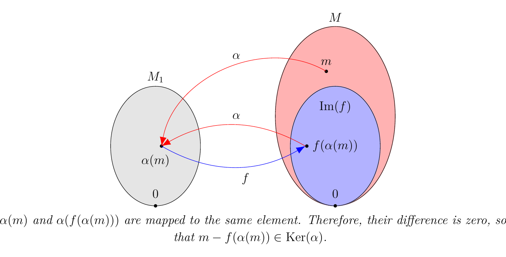
Since $f: M_1 \to M$ is injective, we see that $\alpha: M
\to M_1$ is surjective. To see this, let $m' \in M_1$.
Then there exists an $m'' \in M$ such that $\alpha(m'') = m'$;
namely, $m'' = f(m')$ works. 

Since $\alpha$ is surjective, we see that 

\[
\{f(\alpha(m)) \mid m \in M\} = \{f(m_1) \mid m_1 \in M_1 \} = \im(f).
\]

That is, $f(\alpha(M)) = f(M_1) = \im(f)$.
And because $\textcolor{red}{m - f(\alpha(m)) \in \ker(\alpha)}$ for all $m
\in M$, we see that $m \in \im(f) + \ker(\alpha)$ for
all $m \in M$. Hence, $M \subset \im(f) + \ker(\alpha)$.
But both $\im(f)$ and $\ker(\alpha)$ are subsets of $M$.
Therefore, $M = \im(f) + \ker(\alpha)$.     

Now let $x \in \ker(\alpha) \cap \im(f)$. Then $f(y) = x$
for some $y \in M_1$, and $\alpha(x) = 0$ as well. Hence, 

\[
\alpha(f(y)) = \alpha(x) = 0.
\]

But $\alpha \circ f = 0$, which implies that $y = 0$.
Therefore $\ker(\alpha) \cap \im(f) = \{0\}$. 

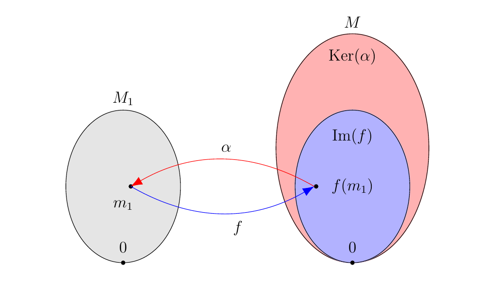
By Theorem
1.\ref{fin_module_sums}, we see that this implies that 

\[
M \cong \im(f) \oplus \ker(\alpha).
\]

Hence, $M$ is split exact as $\im(f)$ is a direct summand
of $M$.

\item[($\bm{2 \implies 3}$).] Suppose (2) holds. We'll show that $\textcolor{blue}{m - \beta(g(m)) \in \ker(g)}$ for all $m \in M$. 

To show this, observe that 

\begin{align*}
g[m - \beta(g(m))] &=g(m) - g \circ \beta(g(m))\\
&= g(m) - g(m)\\
&= 0
\end{align*}

where in the second step we used the fact that $g \circ
\beta = 1_{M_2}$. Therefore, $\textcolor{blue}{m -
\beta(g(m)) \in \ker(g)}.$

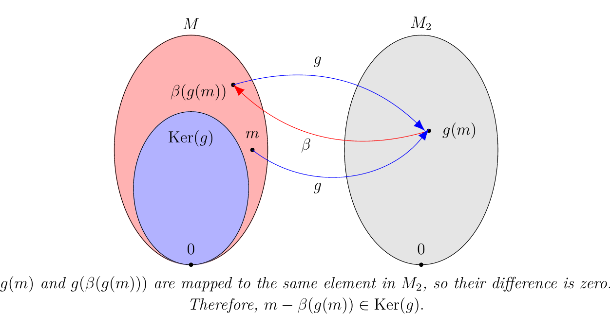

Now note that 

\[
\{ \beta(g(m)) \mid m \in M\} = \{\beta(m_2) \mid m_2 \in M_2\} = \im(\beta)
\]

where in the second step we used the fact that $g$ is
surjective. That is, $\beta(g(M)) = \beta(M_2) = \im(\beta)$. Therefore we see that 

\[ 
m \in \im(\beta) + \ker(g)
\]

for all $m \in M$ which implies that 
$M \subset \im(\beta) + \ker(g)$. But since $\im(\beta)$
and $\ker(g)$ are both subsets of $M$, we see that $M =
\im(\beta) + \ker(g)$. 

Now let $m' \in \im(\beta) \cap \ker(g)$. Then there
exists an $m_2 \in M_2$ such that $\beta(m_2) = m'$.
Furthermore, since $m' \in \ker(g)$, 

\[
0 = g(m') = g(\beta(m_2)) = m_2
\]

since $g \circ \beta = 1_{M_2}$. Hence, $m_2 = 0$, so that
$\beta(m_2) = 0 = m$. Therefore $m = 0$, so that
$\im(\beta) \cap \ker(g) = \{0\}$. 

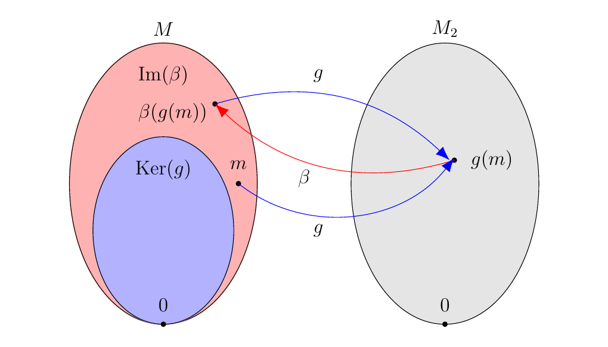

By Theorem
1.\ref{fin_module_sums}, we have that 

\[
M \cong \im(\beta) \oplus \ker(g)
\]

so that $M$ is split exact, as one of its direct summands is $\ker(g)$.

\item[($\bm{1 \implies 2}$).]
Suppose (1) holds. Construct a function $\beta: M_2 \to M$
defined by 

\[
\beta(u) = v - f(\alpha(v))
\]

where $g(v) = u$. Since $G$ is surjective, we know that
such a $v$ exists, although we don't know if it is the
only $v \in M$ which maps to $u$, and if that could cause
us problems. Thus we'll show that
this definition is well defined (i.e. independent of the
choice of $v$). 

\begin{description}
\item[Well-defined.] 
Suppose $g(v') = u$ for some other $v' \in M$. Then

\begin{align*}
g(v') - g(v) &= v - f(\alpha(v)) - (v' - f(\alpha(v')))\\
&= (v - v') - f(\alpha(v)) + f(\alpha(v'))\\
&= (v - v') - f(\alpha(v) - \alpha(v'))\\
&= \textcolor{red}{(v - v') - f(\alpha(v - v'))}\\
&= 0.
\end{align*}

We will prove the conclusion made in red, i.e., 
$\textcolor{red}{(v - v') - f(\alpha(v - v'))} = 0.$
\\

To see this, first note that, as we proved earlier, $\textcolor{red}{x
- f(\alpha(x))} \in \ker(\alpha)$
for all $x \in M$. Hence, $\textcolor{red}{(v - v') - f(\alpha(v - v'))}
\in \ker(\alpha)$. 
\\

Furthermore,
since $g(v) = g(v')$, we see that $g(v - v')
= 0 \implies v - v' \in \ker(g)$. But $\ker(g) = \im(f)$,
so that $\textcolor{red}{v - v'} \in \im(f)$.
Obviously $\textcolor{red}{f(\alpha(v - v'))} \in
\im(f)$ for any $v \in M$, so that 
$\textcolor{red}{(v - v') - f(\alpha(v - v'))}
\in \im(f).$
\\

Thus we have that $\textcolor{red}{(v - v') - f(\alpha(v - v'))} \in \im(f)
\cap \ker(\alpha) = \{0\}$, so that $g(v) - g(v') =
0$.  
\end{description}
Next observe that for any $u \in M_2$ we have that 

\begin{align*}
g \circ \beta (u) &= g(v - f(\alpha(v)))\\
&= g(v) - (g \circ f)(\alpha(v))\\
&= g(v)
\end{align*}

where in the second step we used the fact that $(g \circ
f) = 0$ as $\ker(g) = \im(f)$. Thus we have that $g \circ
\beta = 1_{M_2}$, so that such a desired $\beta: M_2 \to M$
exists. 

\item[$\bm{(2 \implies 1)}$.] Suppose (2) holds. Construct
a function $\alpha : M \to M_1$ defined by 

\[
\alpha(m) = f^{-1}(m - \beta (g(m))).
\]

Note that we must be careful since we're dealing with an
inverse. To even make such a statement, we first recall
that $f$ is injective, so an inverse from $f^{-1}: \im(f) \to M$
certainly exists. But it only exists if its domain is at
most $\im(f)$. Thus we check that $\textcolor{blue}{m - \beta(g(m)) \in
\im(f)}$ for all $m \in M$.

Earlier we proved that $\textcolor{blue}{m -
\beta(g(m)) \in \ker(g)}$, and we know that $\ker(g) =
\im(f)$ as the sequence is exact.
Therefore, we already know that $\textcolor{blue}{m -
\beta(g(m)) \in \im(f)}$.

Hence, $\alpha$ makes sense
since $f^{-1}$ exists and $m - \beta(g(m)) \in \im(f)$ for
all $m \in M$.

Now observe that for any $m_1 \in M_1$, 

\begin{align*}
\alpha \circ f(m_1) &= f^{-1}(f(m_1) - \beta(g(f(m_1))))\\
&= f^{-1}f(m_1) - f^{-1}(0)\\
&= m_1
\end{align*}

since $g(f(m_1)) = 0$ for all $m_1 \in M$. Thus such a
desired $\alpha$ exists.

\item[($\bm{3 \implies 1}$ \& 2).]
Suppose that 

\[
M \cong M'\oplus M''
\]

where $M' = \im(f) = \ker(g)$, and $M''$ is some other
summand of $M$. Define a projection map $\pi: M \to M'$ as

\[
\pi(m) =
\begin{cases}
m & \text{ if } m \in M'\\
0 & \text{ otherwise}
\end{cases}
\]

and similarly the injective map $i: M'' \to M$ as $i(m'')
= m''$ for all $m'' \in M$. 

Consider $\pi \circ f: M \to M'$. Since $M' = \im(f)$,
this is clearly an isomorphism. Now define $\alpha = (\pi
\circ f)^{-1} \circ \pi_1$ and observe that $\alpha
\to M \to M_1$ and 

\[
\alpha \circ f = (\pi \circ f)^{-1} \circ \pi_1 \circ f = 1_{M_1}.
\]

Hence, $(3) \implies (1)$.

Similarly, observe that $g \circ i: M'' \to M_2$ is also
an isomorphism. To see this, first observe that $M' =
\ker(g)$, and since $M \cong M' \oplus M''$ we know that
$M' \cap M'' = \{0\}$. Therefore, if $m \in M''$ is
nonzero, then $m \not\in \ker(g)$. Hence $g(i(m)) \ne 0$
if and only if $m = 0$, so that $g \circ i$ is one to one.
Now surjectivity is clear, as $g$ itself is a surjective
function. 

Now define $\beta = i \circ (g \circ i)^{-1}$, and observe
that $\beta : M_2 \to M$ and 

\[
g \circ \beta = g \circ i \circ (g \circ i)^{-1} = 1_{M_2}.
\]

Therefore $(3 \implies 2)$, which completes the entire proof.
\end{description}

That was a long ass proof, but the theorem is very powerful and
worthwhile. Next, we'll reintroduce the concept of $\hom()$.
\\

\noindent **Inducing Homomorphisms.**

\begin{minipage}{0.6\textwidth}
Let $M, N$ and $N'$ be $R$-modules, and let $\phi: M \to N$ and $f: N
\to N'$ be $R$-modules homomorphisms. Then we see that
the diagram to the right commutes.

\end{minipage}
\hfill
\begin{minipage}{0.4\textwidth}

\end{minipage}
\vspace{0.5cm}

\begin{minipage}{0.6\textwidth}
However, suppose we feed the above diagram with arbitrary $\phi: M
\to N$. That is, we keep $f: N \to N'$ fixed, but let $\phi: M
\to 
N$ vary over all possible $\phi$. This is equivalent to grabbing
elements from the abelian group $\hom_R(M, N)$. We can denote
this with a red arrow, to remind the reader that this arrow
"picks" $\phi$. 
\end{minipage}
\hfill
\begin{minipage}{0.4\textwidth}

\end{minipage}

\begin{minipage}{0.6\textwidth}
Note that we've described a well-defined system for assigning for each $\phi
\in \hom_R(M, N)$ a function 

\[ 
f \circ \phi.
\]

Also, $f \circ \phi
: M \to N'$, so that $f \circ \phi \in \hom_R(M, N')$. We can
denote this with a blue arrow, to communicate that
$\hom_R(M,N')$ "accepts" $f \circ \phi$ (after all, it is an element of
the set).
\end{minipage}
\hfill
\begin{minipage}{0.4\textwidth}

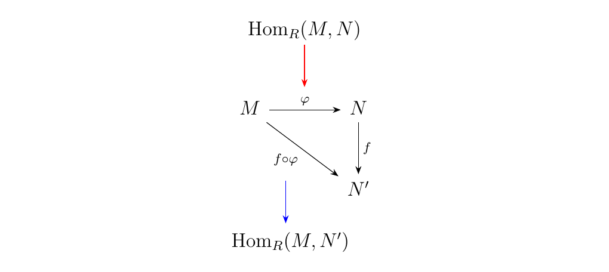
\end{minipage}
\vspace{0.5cm}

\begin{minipage}{0.6\textwidth}
What we've just described is an *induced* function,
which we denote as $f_*$.
That is, if we fix $f$, then we can create a homomorphism
$f_*$  between the abelian groups $\hom_R(M, N)$ and
$\hom_R(M, N')$, where for each element $\phi \in \hom_R(M, N)$
we assign it the function $f \circ \phi \in \hom_R(M, N')$.
\end{minipage}
\hfill
\begin{minipage}{0.4\textwidth}

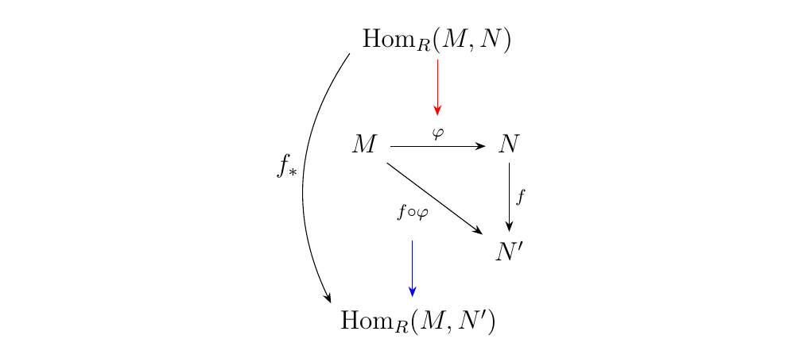
\end{minipage}

\noindent $\hom_R(- , M)$.\\
The we restate our results. If $N, N'$ are $R$-module homomorphisms and $f: N \to N'$ is an $R$-module
homomorphism, then for any $R$-module $M$ we can create an induced
homomorphism 

\[ 
f_* : \hom_R(M, N) \to \hom_R(M, N')
\]

defined as 

\[
f_*(\phi) = f \circ \phi.
\]

\noindent $\hom_R(M, -)$.\\
Similarly, if $N, N'$ are again $R$-modules and $g: N' \to N$ is a an
$R$-module homomorphism, then for any $R$-module $M$, there is
an induced homomorphism 

\[
g^*: \hom_R(N, M) \to \hom_R(N', M)
\]

defined as 

\[
g^*(\psi) = \psi \circ g.
\]

It turns out in category theory that the behavior of these
functions fit the definition of a **functor**.
$\hom_R(- , M)$ is known as a covariant functor,
while $\hom_R(M, -)$ is known as a contravariant
functor. We won't delve too much into this.

\textcolor{NavyBlue}{Since the $\hom_R$ groups are abelian, we see that $f_*$ and $g_*$
are in fact group homomorphisms. If $R$ is commutative, then we
know that $\hom_R$ forms an $R$-module in which case $f_*$ and
$g_*$ become $R$-module homomorphisms.}
\\

Now suppose a family of $R$-modules $\{M_i \mid i \in \mathbb{N}\}$ associated with a
set of homomorphisms $\{f_i \mid f_i :M_{i-1} \to M_i, i
\in \mathbb{N}\}$ for a long sequence, not necessarily exact.

Then if we apply the $\hom_R(M, -)$ functor,
then we see that the above sequence implies a sequence between the
$\hom$ groups:

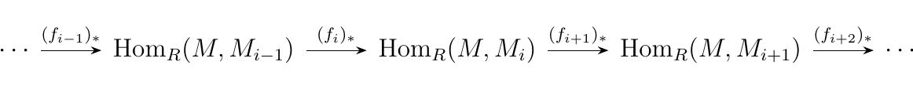
and applying the $\hom_R(-, M)$ functor we get 

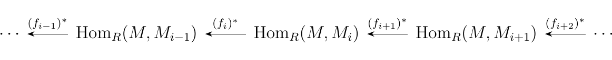

Thus the long sequence of $R$-modules implies the existence of two other long
sequences of abelian groups. The interesting thing is that the two sequences are
similar but differ in the direction of the arrows (this is why we
denote the functions separately with an asterik either in the
subscript or superscript). Furthermore,
the direction of the arrows in the first seuqence of $M_i$
$R$-modules determines the direction of the arrows in the other
two sequences. 

Let $M_1, M$ and $M_2$ be $R$-modules, and suppose $f:M_1 \to
M$ and $g:M \to M_2$ are $R$-modules. Then the sequence
\begin{equation}

\end{equation}
is exact if and only if the sequence 
\begin{equation} 

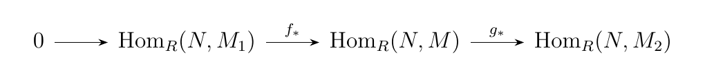

\end{equation}
is an exact sequence of abelian groups. Furthermore, the sequence 
\begin{equation}

\end{equation}
is exact if and only if 
\begin{equation}

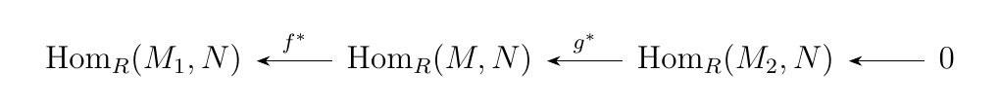

\end{equation}
is an exact sequence of abelain groups.

\textcolor{MidnightBlue}{To show that the sequence between the
$\hom$ abelian groups is exact, we need to check that (1)
$f_*$ is injective and (2) $\im(f_*) = \ker(g_*)$.
}
\begin{description}
\item[$\bm{f_*}$ is injective.]
Suppose that $f_*(\psi) = 0$ for some $\phi \in
\hom_R(N, M_1)$. Then 

\[
f_*(\psi) = 0 \implies f(\psi(n)) = 0
\]

for all $n \in M$. However, $f$ is injective, so that
$\ker(f) = \{0\}$. Therefore $\psi(n) \in \ker(f) =
\{0\}$ for all $n$, which means that $\psi$ is the
zero function. Therefore $\ker(f_*) = \{0\}$ (where
the zero here stands for the zero function between $N$
and $M_1$) so that $f_*$ is injective. 

\item[$\bm{\im(f_*) \subset \ker(g_*)}$.]
Let $\phi \in \hom_R(N, M_1)$. Then observe that 

\[
g_*(f_*(\phi)) = g_*(f \circ \phi) = g \circ f \circ \phi = 0
\]

since $g \circ f = 0$ as $\im(f) =
\ker(g)$.
Therefore we see that $\im(f_*) \subset \ker(g_*)$. 

\item[$\bm{\ker(g_*) \subset \im(f_*)}$.]
Let $\psi \in \hom_R(N, M)$ and suppose that $g_*(\psi)
= 0$. Note that 

\[
g_*(\psi) = 0 \implies g(\psi(n)) = 0
\]

for all $n \in N$. Since $\ker(g) = \im(f)$, we know
for all $n \in N$ that $\psi(n) \in \im(f)$.
Therefore, there exist a set of $y \in M_1$ such that
$f(y) = \psi(n)$, and since $f$ is one to one this
correspondence is uniquely determined. 

Thus construct a function $\tau: N \to M_1$ such that 

\[
\tau(n) = f^{-1}(\psi(n)).
\]

As we discussed, this function is well defined since
$f$ is one-to-one, and therefore there is always a
unique value of $f^{-1}(\psi(n))$ for each $n$. Now
note that this function is an $R$-module homomorphism since, for
any $n_1, n_2 \in N$ and $a \in R$  

\begin{align*}
\tau(n_1 + n_2) &=  f^{-1}(\psi(n_1 + n_2))\\
&= f^{-1}(\psi(n_1) + \psi(n_2))\\
&= f^{-1}(\psi(n_1)) + f^{-1}(\psi(n_2))\\
&= \tau(n_1) + \tau(n_2)
\end{align*}

and 

\begin{align*}
\tau(an_1) &= f^{-1}(\psi(an_1))\\
&= f^{-1}(a\psi(n_1))\\
&= af^{-1}(\psi(n))\\
&= a\tau(n_1).
\end{align*}

Therefore we see that $\tau \in \hom_R(N_1, M)$ and that

\[
f_*(\tau) = f_*(f^{-1}(\psi)) = f(f^{-1}(\psi))= \psi.
\]

Hence, $\psi \in \im(f_*)$. Hence $\ker(g_*)
\subset \im(f_*)$, which proves that $\ker(g_*) =
\im(f_*)$.  
\end{description}
\textcolor{MidnightBlue}{To prove the reverse direction, we
will assume the exactness of the second sequence and show that
(1) $f$ is injective and (2) $\im(f) = \ker(g)$.}

\begin{description}
\item[$\bm{f}$ is injective.] Suppose that sequence
\ref{0_homM1_homM_homM2_exact_sequence} is exact for all
$R$-modules $N$. Then let $N = \ker(f)$, and since $N
\subset M_1$ consider the
inclusion map $i: N \to M_1.$  Note however that for any
$n \in N$ we see that 

\[
f_*(i(n)) = f(i(n)) = 0
\]

since $\im(i) = \ker(f)$. Hence, $i \in \ker(f_*)$. 
However, since $f_*: \hom_R(N,
M_1) \to \hom_R(N, M)$ is injective, we know that
$\ker(f_*) = 0$. Therefore we have that $i = 0$, (i.e. it
is a zero map). But since we defined this to be the
*inclusion* map, we have that $N = \{0\}$. Hence,
$\ker(f) = N = \{0\}$, so that $f$ is one to one.

\item[$\im(f) \subset \ker(g)$.] 
Let $N = M_1$, and let $1_{M_1}:M_1 \to M_1$ be the
identity. Then we see that 

\[
0 = g_*(f_*(1_{M_1})) = g \circ f
\]

by exactness of sequence
\ref{0_homM1_homM_homM2_exact_sequence}. Therefore we see
that $\im(f) \subset \ker(g)$. 

\item[$\ker(g) \subset \im(f)$.]

\end{description}

Let $N$ be an $R$-module. If 

is a split exact sequence of $R$-modules, then 

and 

are split exact sequences of abelian groups ($R$-modules if
$R$ is commutative).

\textcolor{MidnightBlue}{By the previous theorem, we only need
to show that $g_*$ and $f^*$ are surjective and that the two
sequences split.
}
Since the first sequence splits, let $\beta: M_2 \to M$ be the
function which splits the first sequence. Consider the
function $\beta_*:
\hom_R(N, M_2) \to \hom_R(N, M)$. 
Then observe that for any $\psi \in \hom_R(N, M_2)$ that 

\[
g_* \circ \beta_* (\psi) = g_*(\beta(\psi)) = g \circ \beta(\psi) 
= \psi.
\]

Therefore, we see that $g_* \circ \beta_* = 1_{\hom_R(M_{2}, N)}.$ Hence by
Theorem 1.\ref{split_exact_lemma}, we see that $\beta_*$
splits the second sequence. However, note also that $g_* \circ
\beta_* = 1_{\hom_R(M_{2}, N)}$ implies that $g_*$ is surjective. Therefore
the second sequence is split exact.
\\

As for the third sequence, consider the function $\alpha^*:
\hom_R(M_1, N) \to \hom_R(M, N)$. Note that for any $\phi \in
\hom_R(M, N)$, we have that 

\[
\alpha^* \circ f^*(\phi) = \alpha^*(f(\phi)) = \alpha \circ f(\phi) = \phi.
\]

Hence we see that $\alpha^* \circ f^*$ splits the third
sequence. Furthermore, the fact that $\alpha^* \circ f^* =
1_{\hom_R(M, N)}$ implies that $f^*$ is surjective. Thus in total
we have that the third sequence is in fact a split exact sequence.

The next theorem is a nice result that shows that $\hom_R$ is
somewhat of a "linear" operator.

Let $M_1, M_2$ and $M$ be $R$-modules. Then 

\[
\hom_R(M, M_1\oplus M_2) \cong \hom_R(M, M_1)\oplus \hom_R(M, M_2)   
\]

and 

\[
\hom_R(M_1 \oplus M_2, M) \cong \hom_R(M_1, M) \oplus \hom_R(M_2, M).
\]

\vspace{-0.7cm}

These are in general isomorphisms of abelian groups, but can
be isomorphisms of $R$-modules if $R$ is commutative.

Consider one of our earlier examples of a split exact
sequences:

where $i$ defined as $i(m_1) = (m_1, 0)$ is the inclusion map
and $\pi$ defined by $\pi(m_1, m_2) = m_2$ is the projection
map. As this is split exact, we can apply the previous theorem
to gaurantee the existence of sequences 

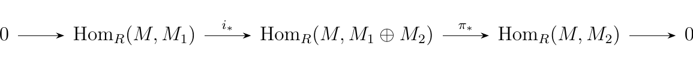
and 

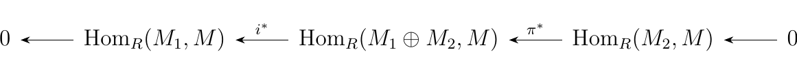
which are both split exact. Then by applying Theorem
1.\ref{split_exact_lemma} we have that 

\[
\hom_R(M, M_1 \oplus M_2) \cong \hom_R(M, M_1) \oplus \hom_R(M, M_2)
\]

and 

\[
\hom_R(M_1 \oplus M_2, M) \cong \hom_R(M_1, M) \oplus \hom_R(M_2, M).
\]

