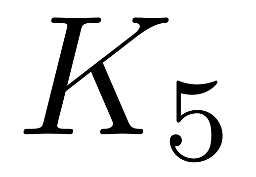
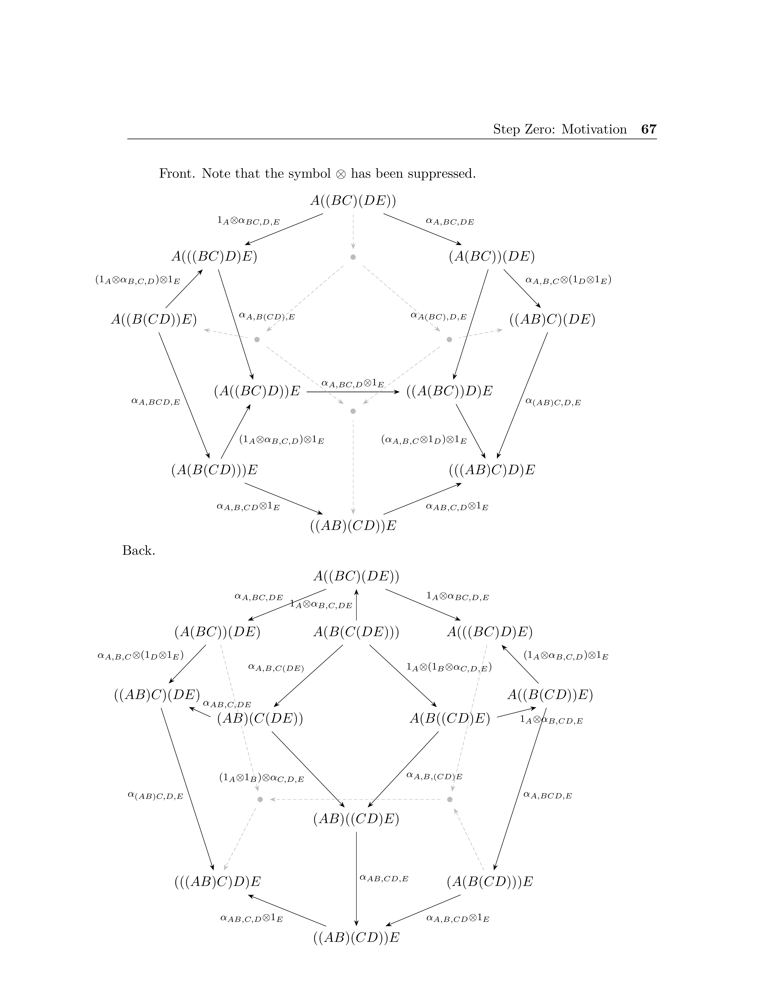

---
hide:
  - navigation
  - toc
---

The [Associahedra](https://en.wikipedia.org/wiki/Associahedron) are a very mathematically deep family of polytopes (one in each dimension) that occur frequently in combinatorics, under many different interpretations. A fascinating fact about them is that the coefficients of the multiplicate inverse of a power series encode the polyhedra face data of the Associahedra (see Marcelo Aguiar and Frederico Ardilla's [paper](https://arxiv.org/abs/1709.07504)).

Here's an interactive 3D web app of the first 7. They're all projected to R^3, and K_5 is the family member that naturally lives in R^3. I made this with the help of this [3D-Force-Graph](https://github.com/vasturiano/3d-force-graph) library.

    

    

    

        

            
        

        

 
    

## Comments on the app
* Click and drag to rotate the figure. You can zoom in and out and also hover over the nodes to see what binary word it corresponds to. 

* You can use the slider to change which Associahedron you look at. I have the data for K_8, K_9, and K_10, but displaying them has made my browser crash.

* You can toggle the Binary Words option to literally see what binary word corresponds to each node.

* You can toggle the Arrows to further understand the combinatorial interpretation. I interpret an arrow as shifting the parenthesis of a binary word once to the left. Thus, you'll notice the binary word with its parentheses all to the left have arrows point *to* it, and the binary word with its parentheses all to the right have arrows pointing *from* it. 

## Motivation
I came across the associahedra during my undergraduate thesis, which involved obtaining a true understanding of Mac Lane's Coherence theorem and Mac Lane's proof, so that I could spell the whole thing out in a organized manner once and for all. This was actually due to a lack of finding satisfactory resources that explained Mac Lane's proof. Resources that attempted to explain it were either wrong, hand-waved, or simply copying Mac Lane's language without putting it in their own words. (I came to understand why this is, and it's because it's a very, very long, subtle, time consuming, but not terribly hard proof). It dawned on me that nobody who had taken the time to truly understand it wrote about their understanding. I thought that was unfortunate because it's a frequently cited result and it states a very important, powerful idea in category theory. 

Interestingly, in Mac Lane's proof, he does not mention at all the connection that his proof had with the associahedra. He most definitely knew there was a connection (I would bet that he had spoken with or knew of Jim Stasheff, who wrote about the associahedra, since they worked in related areas), but I do wonder why he didn't mention it.

Here are some further things you can look at.

* My thesis [A Coherent Proof of Mac Lane's Coherence Theorem](https://scholarship.claremont.edu/hmc_theses/243/). It is for anyone who ever needs to really understand each exact detail of Mac Lane's proof, or anyone who is just curious about the details. Here's a nice picture of K_5 that I produced in my thesis.

 

* [The raw polyhedra face data of the associahedra in JSON format](https://github.com/ltrujello/Monoidal_Coherence_and_Binary_Words/tree/master/associahedra_in_3D/json), as well as [the python code that generated the data here](https://github.com/ltrujello/Monoidal_Coherence_and_Binary_Words/blob/master/binary_word_Class/associahedron.py). It was a quite a pain to generate and verify to be correct, so I hope if someone needs this data they can find it here before going through the trouble of generating it again.        
