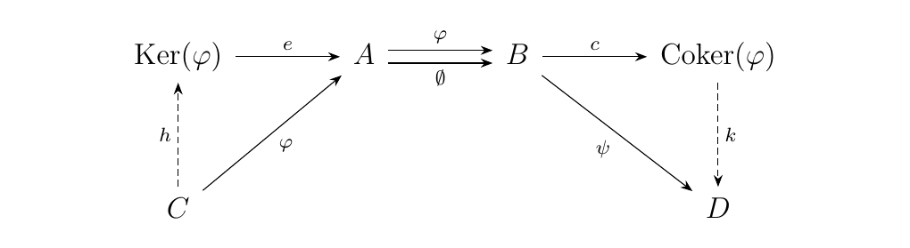
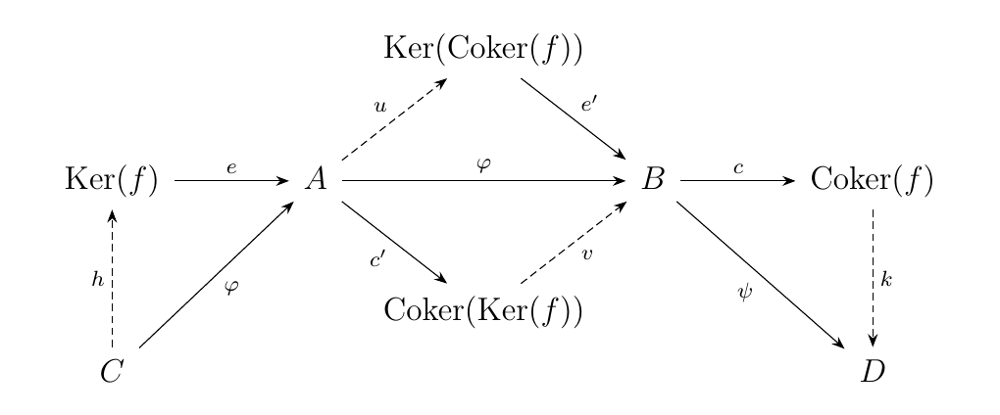

#8.5. Abelian Categories

Let $\cc$ be a preabelian category, and consider an arbitrary morphism 
$\phi: A \to B$. Then, since we are in an abelian category, we can calculate 
the kernel and cokernel of this morphism, which both have their familiar 
universal properties. 

One thing we can do is examine both the kernel and the cokernel *of* these two morphisms.
Specifically, we can calculate the kernel $\ker(c)$ of $c$ and the cokernel 
$\coker(e)$ of $e$. However, since we have a map $\phi: A \to B$ such that 
$c \circ \phi = 0$, we see that there exists a unique map $u: A \to \ker(\coker(f))$
such that $\phi = e' \circ u$. 
Dually, since $\phi \circ e = 0$, there exists a unique map $v: \coker(\ker(f)) \to B$. 
such that $\phi = v \circ c'$. 
\

