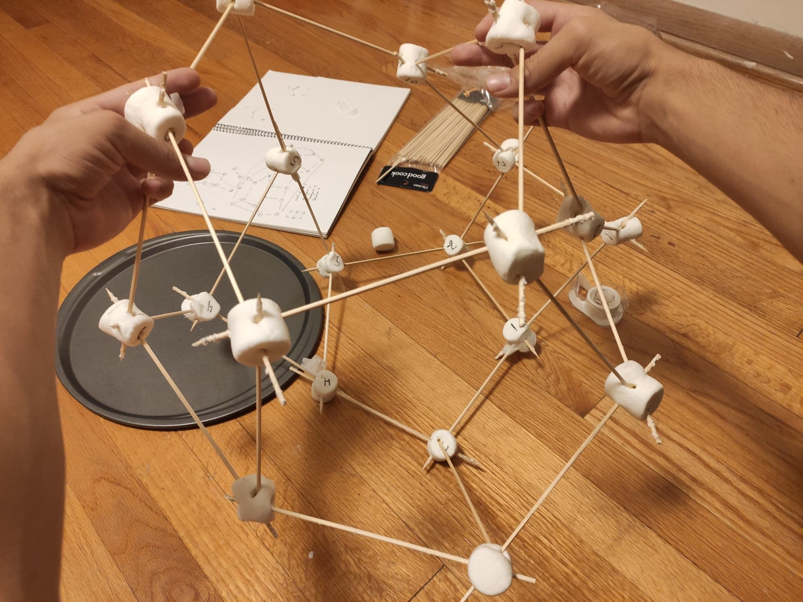

---
hide:
  - navigation
  - toc
---
# Home

Hi, my name is Luke and you've found my website. 

I am fascinated by language and enjoy working on things that make it faster and easier for others 
to disseminate and understand technical information. 

Here are some things you can look at. 

* My senior thesis [*A Coherent Proof of Mac Lane's Coherence Theorem*](https://scholarship.claremont.edu/hmc_theses/243/), which explicitly 
outlines the proof details of Saunders Mac Lane's 50 year old theorem.

* A [large note set](/category_theory/) on Category Theory, a beautiful branch of mathematics. 

* A [large note set](/algebra/) on Algebra. 

* [Proofs in topology](https://ltrujello.github.io/topology/topology_notebook_5_2019.pdf), which I did for an undergraduate course in topology and homotopy theory. 

The picture on the right is from when I went crazy one night with marshmallows and sticks 
in order to study the [associahedron](associahedron) in $\mathbb{R}^3$ for my undergrad thesis.

