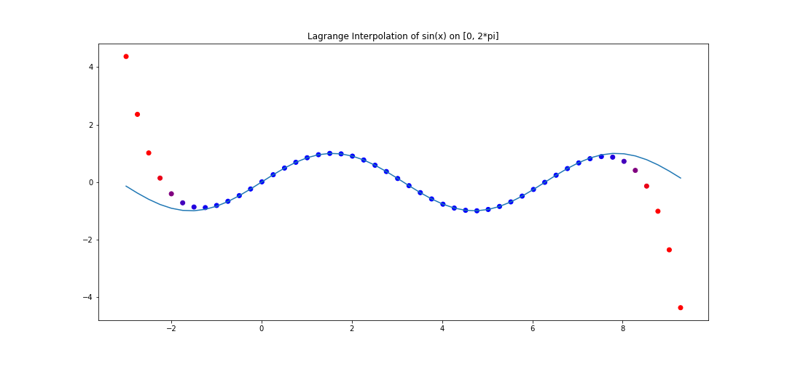
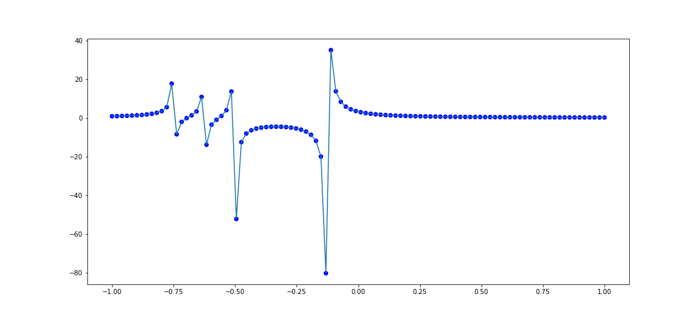
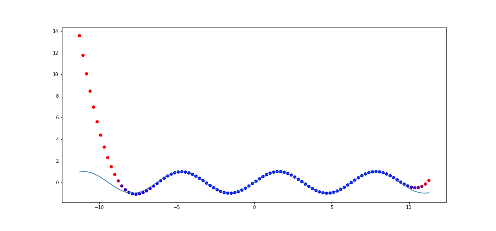
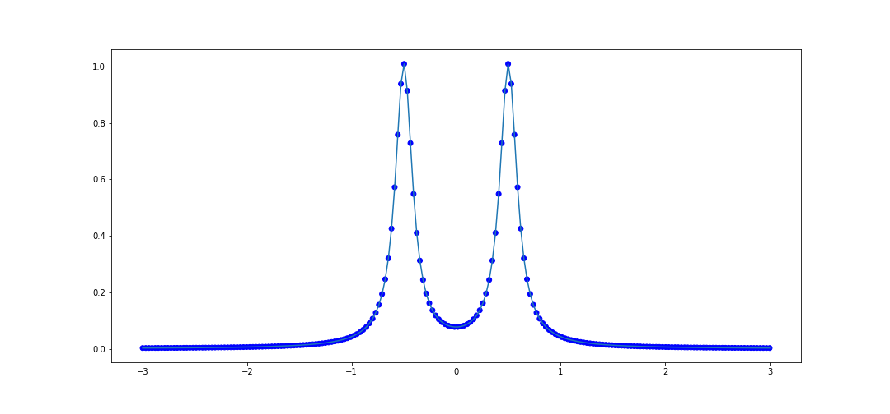
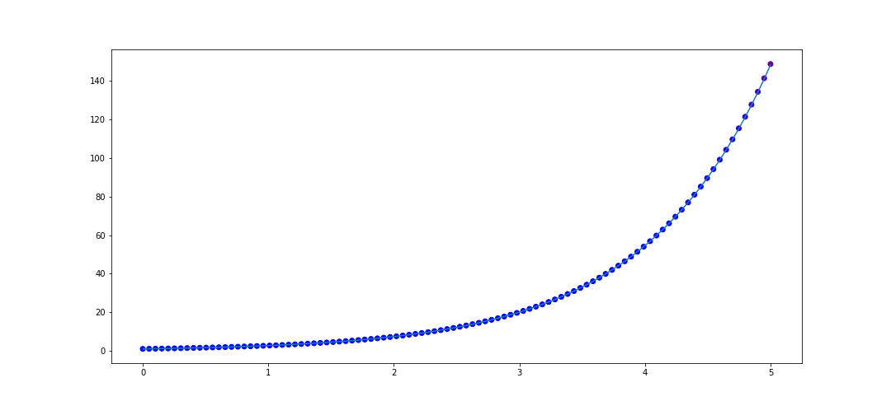
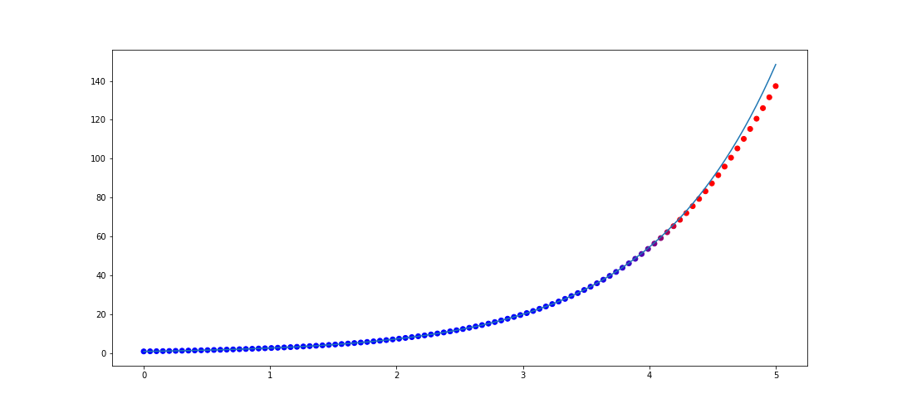

<!-- title: Rational Interpolation -->
<!-- syntax_highlighting: on -->
<!-- date: 2021-09-01  -->
<!-- mathjax: on -->

I recently uncovered a hidden gem when it comes to literature on rational interpolation. It's this PhD thesis by someone named Antonio Cosmin Ionita titled *Lagrange rational interpolation and its applications to approximation of large-scale dynamical systems*. I've found that finding good resources on rational interpolation is really hard, so this is a great resource.
<!-- more -->

It turns out that interpolating a set of coordinates with a rational function gives a much better approximation than with a polynomial interpolation. Additionally, for some datasets, a *unique* rational interpolant exists. This is the case with polynomial interpolation, but it's surprising that this would extend to the rational case because rational polynomials are much more complex. 

## Background 

The idea is that one has a dataset of the form $(x_i, f_i)$ with $i = 0, 1, 2, \dots, N$, and you would like to interpolate the data with some rational function.

In the polynomial case, the way that you solve this is by using a family of functions known as the **Lagrange Polynomials**. Given a a set of data $(x_i, f_i)$, the Lagrange polynomials are the polynomials
\begin{align}
    \ell_0(x) &= (x - x_1)(x - x_2)\cdots (x - x_N) = \prod_{i \ne 1}^{N}(x - x_i)\\\\
    \ell_1(x) &= (x - x_0)(x - x_2)\cdots (x - x_N) = \prod_{i \ne 2}^{N}(x - x_i)\\\\
    \vdots    &= \vdots \\\\
    \ell_N(x) &= (x - x_0)(x - x_1)\cdots (x - x_{N-1}) = \prod_{i \ne N}^{N}(x - x_i)
\end{align}
One then observes that the polynomial of degree $N$
$$
    p(x) = \sum_{i = 1}^{N} \frac{f_i}{\ell_i(x_i)}\cdot \ell_i(x)
$$ 
interpolates the data. Note the linear algebra interpretation: $\frac{f_i}{\ell_i(x_i)}$ can be regarded as the coefficient and $\ell_i(x)$ as the basis vector.

For example, consider 20 points on $y = \sin(x)$ equidistantly spaced on $[0, 2\pi]$. We can perform lagrange interpolation, and see how the interpolation behaves in the range $[-3, 2\pi + 3]$.



The polynomial interpolation does a good job on the assigned interval, but deviates very quickly outside.

In practice, it is easier to use the **Barycentric** form of the interpolation, since it requires less computational operations. It also turns out to be the right way to think about Lagrange interpolation.Before we introduce that form we need a small fact.

**Lemma:** Let $\ell_i(x)$ be the $i$-th lagrange basis vector for a dataset $(x_i, f_i)$ for $i = 0, 1, 2, \dots, N$. Then 
$$e(x) = \sum_{i = 0}^{N}\frac{1}{\ell_i(x_i)}\ell_i(x) = 1$$

**Proof:** Consider the polynomial $q(x) = e(x) - 1$. Since $e(x_i) = 1$, we see that each $x_i$ is a root of $q(x)$, and so $q(x)$ has $N + 1$ many distinct roots. However, $q(x)$ is a polynmoial of degree at most $N$. Therefore $q(x) = 0$.


Using the above result, we can now write
\begin{align}
p(x) = \frac{p(x)}{e(x)}
= \frac{\sum_{i = 0}^{N} \frac{f_i}{\ell_i(x_i)}\cdot \ell_i(x)}{\sum_{i = 0}^{N} \frac{1}{\ell_i(x_i)}\cdot \ell_i(x) }
= \frac{\ell(x) \cdot \sum_{i = 0}^{N}\frac{f_i}{\ell_i(x_i)}\cdot \frac{1}{x - x_i}}{\ell(x) \cdot \sum_{i = 0}^{N}\frac{1}{\ell_i(x_i)}\cdot \frac{1}{x - x_i}}\\
\end{align}
where $\ell(x) = \prod_{i = 0}^{N}(x - x_i)$. So to reiterate, we just used the fact that
$\ell_i(x) = \frac{1}{x - x_i}\ell(x)$ and then factored and cancelled out $\ell(x)$ from the expression. This gives the **Barycentric form** of polynomial Lagrange interpolation:
$$
p(x) = \frac{\sum_{i = 0}^{N}\dfrac{f_i}{\ell_i(x_i)} \dfrac{1}{x - x_i}}{\sum_{i = 0}^{N}\dfrac{1}{\ell_i(x_i)} \dfrac{1}{x - x_i}}
$$
Note that we can't plug in $x_i$, but that's okay because we already know the value should be $f_i$. This can be easily coded into a program.


## Code 
To begin, we first need some imports. Unlike a lot of code tutorials that randomly import modules in the middle of program bodies (which is bad), we're going to import things once and for all right here.
Note that we don't really need much for this.
```python
import numpy as np
import matplotlib.pyplot as plt
from numpy.linalg import matrix_rank
from scipy.linalg import null_space
```
We first need a simple function to partition our data. Cosmin-Ionita recommends alternate paritioning for best numerical results, so we do that here.
```python
def alternating_partition(xy_data: list[tuple], left_arr_size: int=None) -> tuple:
    """Creates a disjoint partition of the xy_data, one parition being of size left_arr_size.
    """
    lambda_data = [] # Left array x_data
    w_data = [] # Left array y_data
    mu_data = []
    v_data = []

    if left_arr_size is None:
        left_arr_size = len(xy_data) // 2
    elif (2*left_arr_size - 1) > len(xy_data):
        raise ValueError(f"Cannot alternately select {left_arr_size} many points from xy_data")
    for i, pt in enumerate(xy_data):
        x, y = pt
        if (i % 2) == 0 and left_arr_size > 0:
            lambda_data.append(x)
            w_data.append(y)
            left_arr_size -= 1
        else:
            mu_data.append(x)
            v_data.append(y)
    return lambda_data, w_data, mu_data, v_data
```
Next we need to actually code the Loewner matrix. This requires the partitioning function, which is why we introduced it first. Here it is.
```python
def loewner_matrix(x_data: list, y_data: list) -> tuple:
    """Consider  x_data = [x_1, x_2, ..., x_n] with y_data = [y_1, ..., y_n]
    The function 
        1. Creates two disjoint partitions of x_data
            [mu_1, ..., mu_{n_1}], [lambda_1, ..., lambda_{n_2}]
        and corresponding disjoint partitions of y_data 
            [v_1, ..., v_{n_1}], [w_1, ..., w_{n_2}]
        2. Calculates the Loewner matrix defined as 
                        v_i - w_j
            L_{ij} = ---------------
                    mu_i - lambda_j
        3. Calculates the smaller Loewner matrix, based on rank(L_ij)
    and returns the nullspace of this smaller matrix. 
    For more details, see Algorithm 1.1, P. 33 of [Cosmin-Ionita].
    """
    assert len(x_data) == len(y_data), "input x and y data are mismatched"
    # Patition the data
    xy_data = list(zip(x_data, y_data))
    lambda_data, w_data, mu_data, v_data = alternating_partition(xy_data)
    n = len(mu_data)
    m = len(lambda_data)
    
    # Calculate the loewner matrix
    L = np.zeros(n * m).reshape(n, m)
    for i, v_i in enumerate(v_data):
        for j, w_j in enumerate(w_data):
            L[i][j] = (v_i - w_j) / (mu_data[i] - lambda_data[j])

    # Calculate the smaller Loewner matrix, based on rank of L
    rank = matrix_rank(L)
    L_hat = np.zeros((n + m - (rank + 1)) * (rank + 1)).reshape(n + m - (rank + 1), rank + 1)
    lambda_hat, w_hat, mu_hat, v_hat = alternating_partition(xy_data, left_arr_size=rank+1)
    
    for i, v_i in enumerate(v_hat):
        for j, w_j in enumerate(w_hat):
            L_hat[i][j] = (v_i - w_j) / (mu_hat[i] - lambda_hat[j])
            
    return null_space(L_hat), lambda_hat, w_hat
```

We now write the code for the rational interpolater. This is a function that returns a function, because Python is amazing and lets you do that. The function it returns is the rational interpolator.

```python
def rational_interpolant(x_data: list, y_data: list) -> Callable:
    """Returns a rational function that interpolates the xy data."""
    # Compute the loewner matrix, nullspace
    nullspace, lambda_hat, w_hat = loewner_matrix(x_data, y_data)
    nullspace_vec = nullspace[:,0].flatten()
    assert len(lambda_hat) == len(w_hat) == len(nullspace_vec)
    
    def interpolant(x):
        if x in x_data:
            return y_data[x_data.index(x)]
        
        rank = len(lambda_hat)
        numer = 0
        denom = 0
        for i in range(rank):
            a_i = nullspace_vec[i]
            w_i = w_hat[i]
            lambda_i = lambda_hat[i]
            
            numer += (a_i * w_i)/(x - lambda_i)
            denom += a_i/(x - lambda_i)
            
        return numer/denom
        
    return interpolant
```

Finally, we need some code to usefully view our rational interpolation and the original function. We do this by coloring our points, which requires its own function. One thing we have to be careful with is that rational functions naturally have poles, so we need to tip toe around those coordinates. We do so with a `try` statement.

```python
def generate_colors(y_1: list, y_2: list) -> list:
    """Given values y_1 which approximate values y_2, we return a list of RGB values 
    ranging from blue to orange to communicate approximation error
    Blue indicates no error, orange indicates bad error."""
    colors = []
    thresh = 1  # Maximum y_1 - y_2 difference to use a fully orange color
    
    for i in range(len(y_1)):
        diff = abs(y_1[i] - y_2[i])
        if diff > thresh:
            scale = 0
        else:
            scale = abs(thresh - diff)/thresh

        R = 255*(1 - scale)
        G = 0
        B = 255*scale
        colors.append([R/255,G/255,B/255])
    return colors

def plot_interpolater(x_test: list, interpolater: Callable, func: Callable, title: str="") -> tuple:
    """Test and plot the behavior of the interpolater and the function on x_test."""
    y_test = []
    x_test_defined = []  # We collect and leave out values that the function is not defined at
    for x_val in x_test:
        try:
            y_val = interpolater(x_val)
        except ZeroDivisionError:
            pass
        else:
            x_test_defined.append(x_val)
            y_test.append(y_val)
            
    # Collect the function data for this test set of x values
    y_data = [func(x_val) for x_val in x_test_defined]
    
    # Now we plot the defined x_vals and the y_vals
    fig, ax = plt.subplots(figsize=(15,7))
    colors = generate_colors(y_test, y_data)
    plt.title(title)
    plt.plot(ax=ax)
    ax.plot(x_test_defined, y_data)
    ax.scatter(x_test_defined, y_test, c=colors)
    return fig, ax
    
```
This leads to our final wrapper function which conviently processes all of our previous functions.
```python
def interpolate_and_plot(x_data, func):
    # Calculate true data
    y_data = [f(val) for val in x_data]
    
    # Compute the rational interpolant
    rat = rational_interpolant(x_data, y_data)
    plot_interpolater(x_data, rat, f)
```


## Some runs
The first test that Cosmin-Ionita performs is an attempt to model points selected from the curve 
$$
f(x) = \frac{1}{1 + 100(x + 1/2)^2} + \frac{1}{1 + 100(x-1/2)^2}.
$$
We can test rationally interpolating 100 points in the interval $[-1, 1]$:
```python
x_data = list(np.linspace(-1, 1, 100))

def f(x):
    return 1/(1 + 100*(x + 0.5)**2) + 1/(1 + 100(x - 0.5)**2)

interpolate_and_plot(x_data, f)
```
which gives


It looks pretty good. Let's try another rational function:
$$
    f(x) = \frac{4}{8x + 1} - \frac{2}{8x + 4} - \frac{1}{8x + 5} - \frac{1}{8x + 6}
$$
The code to interpolate 100 points within $[-1, 1]$ is 
```python
x_data = [val for val in np.linspace(-1, 1, 100)]
def f(x):
    return 4/(8*x + 1) - 2/(8*x + 4) - 1/(8*x + 5) - 1/(8*x + 6)

interpolate_and_plot(x_data, f)
```
We can view the results here.


This also does pretty well, and it handles the numerous singularities nicely, as it captures the overall behavior near the poles.

## Tests
Let's now see how the interpolation performs outside of the range of interpolation.

In our first example when we discussed interpolation via polynomials, we showed how it performed on $f(x) = \sin(x)$ with 50 points sampled on $[0, 2\pi]$. Let's do the same thing with rational interpolation and see how it performs on $[-(2\pi + 5), 2\pi + 5]$. The code to do this is 
```python
x_data = list(np.linspace(0, 2*np.pi, 50))
y_data = [f(val) for val in x_data]

rat = rational_interpolant(x_data, y_data)
def f(x):
    return np.sin(x)

x_test = list(np.linspace(-(2*np.pi + 5), 2*np.pi + 5, 100))

fig, ax = plot_interpolater(x_test, rat, f)
```
which gives the result


This is a huge improvement compared to polynomial interpolation. This captures a few periods outside of the original range.

Let's try the rational function $f(x) = \frac{1}{1 + 100(x + 1/2)^2} + \frac{1}{1 + 100(x-1/2)^2}.$
again and look at the performance on $[-3, 3]$. The code to do this is as follows.
```python
x_data = list(np.linspace(-1, 1, 100))

def f(x):
    return 1/(1 + 100*(x + 0.5)**2) + 1/(1 + 100*(x - 0.5)**2)
    
y_data = [f(val) for val in x_data]
rat = rational_interpolant(x_data, y_data)

# Test data
x_test = list(np.linspace(-3, 3, 200))

plot_interpolater(x_test, rat, f)
```
In this case it looks like it found the actual rational function it was assigned to interpolate. 



We can try this on the second example from before, similarly on [-3, 3]
```python
x_data = [val for val in np.linspace(-1, 1, 100)]
def f(x):
    return 4/(8*x + 1) - 2/(8*x + 4) - 1/(8*x + 5) - 1/(8*x + 6)

y_data = [f(val) for val in x_data]

# Test data
x_test = list(np.linspace(-3, 3, 200))

plot_interpolater(x_test, rat, f)
```
This also looks like it converged to the actual function.


Now let's take a function which is not rational, $f(x) = e^x$. Let's interpolate 20 points in $[0, 1]$.
The code to do that is 
```python
x_data = list(np.linspace(0, 1, 20))
y_data = [f(val) for val in x_data]

rat = rational_interpolant(x_data, y_data)
def f(x):
    return np.e**x

x_test = list(np.linspace(0, 5, 100))

plot_interpolater(x_test, rat, f)
```
Note that we're seeing how the interpolation performs on $[0, 5]$.


Now what is interesting is if we interpolate more points in in $[0, 1]$, say 50 instead of 20, then we actually get worse performance on $[0, 5]$! The code
```python
x_data = list(np.linspace(0, 1, 50))
y_data = [f(val) for val in x_data]

rat = rational_interpolant(x_data, y_data)
def f(x):
    return np.e**x

x_test = list(np.linspace(0, 5, 100))

plot_interpolater(x_test, rat, f)
```
gives

Thus rational interpolation is subject to overfitting fallacies just like any approximation model. 


